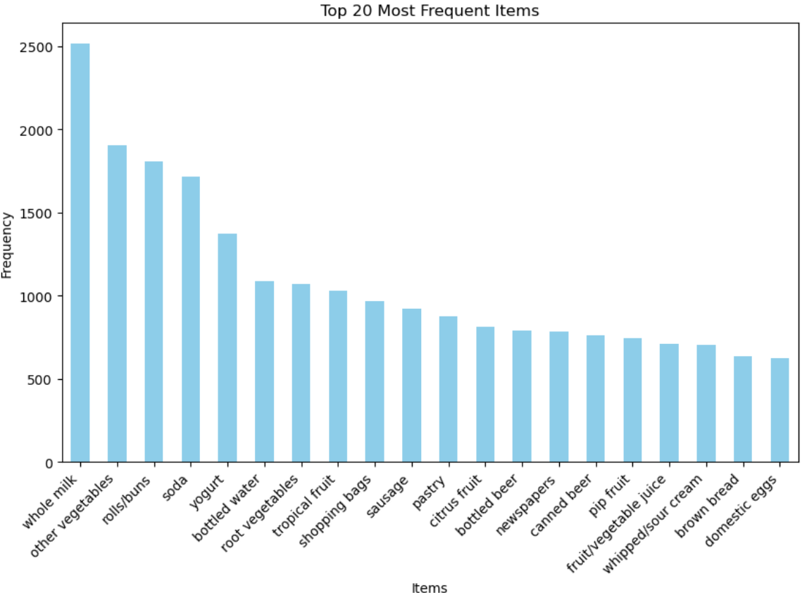
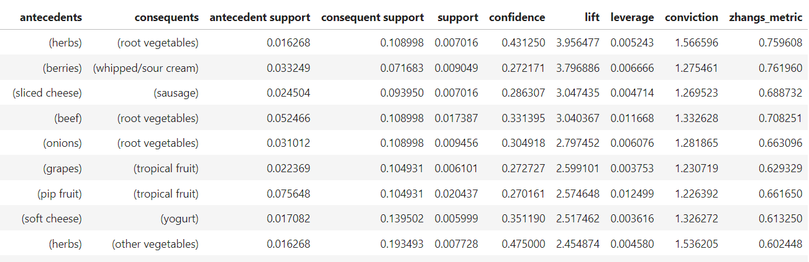
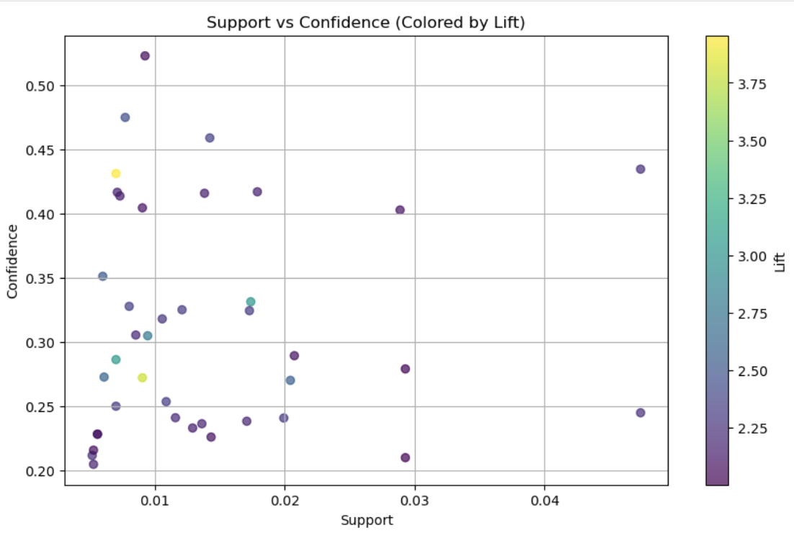
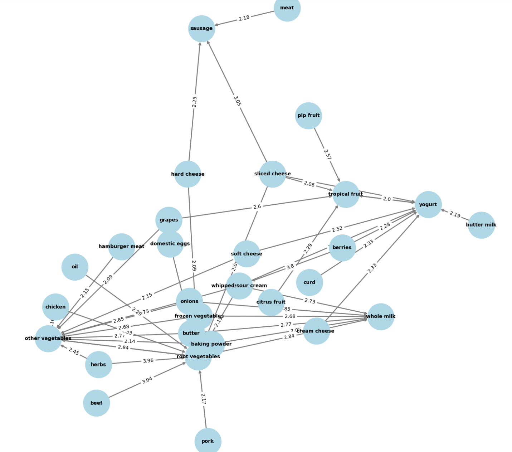
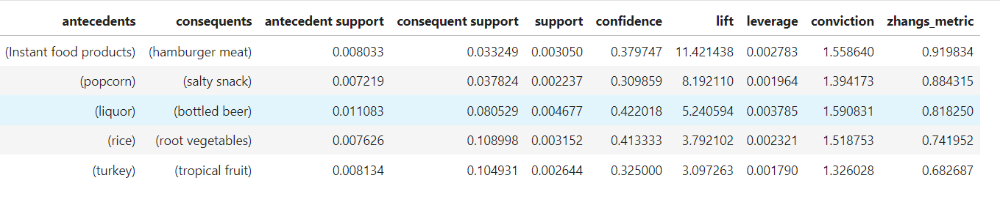
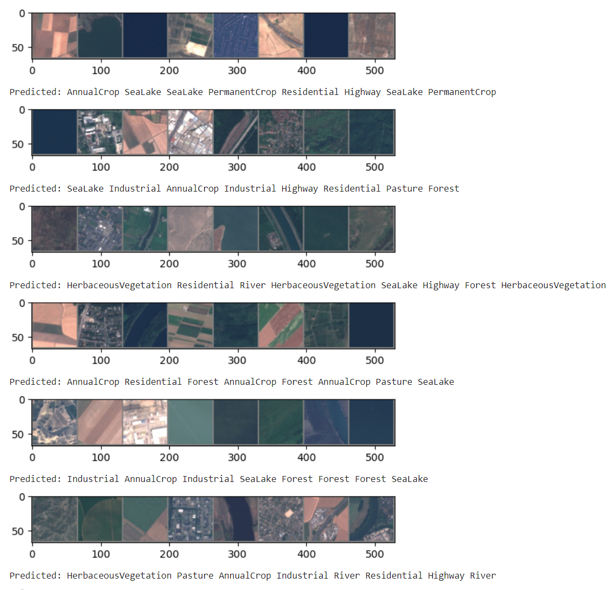
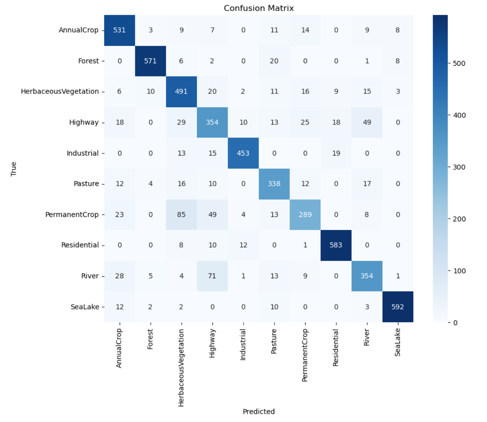

# STA-S380 Exercises
## Probability Practice
### Part A
Using the rule of total probability, we know that:
```math
P(\text{RC}) \times P(\text{Yes} | \text{RC}) + P(\text{TC}) \times P(\text{Yes} | \text{TC}) = P(\text{Yes})
```
With the information given, we can fill in the equation so that: 
```math
0.3 \times 0.5 + 0.7 \times P(\text{Yes} | \text{TC}) = 0.65
```
After solving the equation, we find that **71.4% of people that are truthful clickers answered yes**.

### Part B
Based on Baye's Theorem, we know that:
``` math
 P(\text{Disease} \mid \text{Positive}) = \frac{P(\text{Disease}) \times P(\text{Positive} \mid \text{Disease})}{P(\text{Positive})}
```
We already have information on P(Positive | Disease), and P(Disease). However, now we need to use the rule of total probability to find P(Positive). We know that the probability that someone who tests positive is the sum of the probabilities that someone who does not have the disease takes the test and tests positive plus the probability that someone who has the disease takes the test and tests positive. In equation form:
```math
P(\text{No Disease}) \times P(\text{Positive} | \text{No Disease}) + P(\text{Disease}) \times P(\text{Positive} | \text{Disease}) = P(\text{Positive})
```
Filling in the Equation with the given information, we know: 
```math
0.999975 \times 0.0001 + 0.000025 \times 0.993 = P(\text{Positive})
```
As a result, we know that the probability of someone testing positive is .000125. To find the probability that someone who tested positive actually has the disease, we can plug this into our original equation:
``` math
P(\text{Disease} \mid \text{Positive}) = \frac{0.000025 \times 0.993}{0.000125}
```
After solving this equation, we find that **there is a 19.89% chance that they have the disease**.
## Wrangling the Billboard Top 100
### Part A

Here is a table showing the top 10 most popular songs since 1958, based on the total number of weeks spent on the Billboard Top 100:

<br>The code for creating this table can be found [here](Billboard%20Top%20100.ipynb#part-a).
### Part B
Here is a graph depicting the number of unique songs on the Billboard Top 100 from 1959-2020:

<br>Here, we see a peak of over 800 songs from 1965-1970 before there is a steep drop. In the early 2000s, the music diversity hits a low with just under 400 songs. Then, it quickly jumps back up, almost reaching 800 again in 2020.  
<br>The code for this graph can be found [here](Billboard%20Top%20100.ipynb#part-b).
<br> (Note: You may have to scroll to Part B, as my anchored links have not been working)
### Part C
Here is a bar plot of the number of 10-week hits that artists with over 30 10-week hits have:  
<br>

<br>We can see that Elton John is the artist with the most 10-week hits, with over 50 songs that have stayed on the Billboard Top 100 for at least 10 weeks. He is followed by Madonna, who has just under 44, then Kenny Chesney, who has 42.  
<br>The code for this graph can be found [here](Billboard%20Top%20100.ipynb#part-c).
<br> (Note: You may have to scroll to Part C, as my anchored links have not been working)
## Visual Story Telling Part 1
## Visual Story Telling Part 2: Capital Metro Data
When first looking at the Cap Metro data, I wanted to make sure I understood the overall trends before I dug into the details. As a result, I started very broad. Below, you'll see a graph plotting the average number of people who got on and off the bus on a given day throughout the semester. 

There is an obvious pattern here: large spike followed by large drops. I assumed that this was because the weekdays have a lot more riders than the weekends, as students and university employees will likely not be coming in on the weekends. It's also interesting to note the more prolonged drop in November. This seems to be Thanksgiving break.   
<br> To zoom in on the days of the week and confirm my suspicions, I created two side-by-side bar graphs that you'll see below. It measures the average number of people that got on (left) or off (right) the bus on a given day of the week. 

As I thought, ridership is much higher on the weekdays than on the weekends. It peaks on Tuesdays, stays pretty steady throughout the rest of the weekdays, and then has a slight drop on Fridays. Finally, the weekends have less than about 25% of the weekdays' ridership.   
<br> Now that I examined the patterns of ridership by the day of the week, I wanted to zoom in even further. Below, you'll see two side-by-side line graphs. These are similar to the graphs above in that they measure average ridership, but this time it is by hour of the day, rather than by day of the week. Additionally, since we have now seen a large difference in weekdays versus weekends, I split the graphs on this variable and plotted boarding and alightings together. 

Here, the data shows what we would expect. The number of alightings is high in the mornings, as people are coming to campus for classes or work. Then, boardings hit their peak in the late afternoon/evening, as people get off work or school and head home. The weekends actually show a similar pattern, just at a much less exaggerated level.  
<br> Again, I wanted to zoom in even more. Now, we've seen boardings and alightings by day and by hour. Let's look at the 15-minute increments as well. To do this more effectively, I decided to focus on weekdays only so that the visuals wouldn't get too complicated. Furthermore, this is just where most of the data is, so it would be easier to find more solidified patterns there. Below, you'll again see two graphs. The first is for average alightings for each 15 minute period from 6 am to 12 pm. I zoomed in on this 6 hour period, as it captures the peak of alightings. The second graph is the same for boarding, except it zooms in from 1 pm to 7 pm, in order to capture the peak for alightings.

The peaks for boardings (the second graph) made a lot of sense. The highest is at 5:15 pm. We can assume that people are getting off work and then catching the bus 15 minutes later. However, there is also a really high peak at 2 pm. I would guess that this is for students who have finished their classes for the day and are heading home.  
<br> However, what caught my attention most was in the first graph. There is a clear pattern for four hours, where there is a peak at the 45-minute mark, with a stark drop when the clock hits the hour. Obviously, people are taking the bus in to get to work or classes, which usually start on the hour. Making a few assumptions, I believe we can extract information here on how many people are late on average. When the drop between the 45-minute mark and the hour is very steep, people are more on time. However, when this becomes flatter, more people are late. I decided to focus on average alightings in the morning to see if I could find any other patterns on alightings and lateness.  
<br> Next, I decided to try and see if people are later on specific days. Below, you'll see a graph plotting the average alightings by day of the week. This is a little convoluted, so I have also split the graph three ways. However, I wanted to include the overall graph for an easier comparison of all five days. In the three graphs below, I split them to show Mondays and Wednesdays together, Tuesdays and Thursdays together, and ten Fridays. This is because I found these days followed similar patterns, likely because of how students' schedules work. 


In terms of lateness, there aren't any extremely strong patterns, but there are still some things I'm noticing. First, the drop from 7:45 am to 8 am remains pretty consistent, while there is more variability throughout the rest of the morning. My main theory for this is that 8 am is when work starts, while the later hours are when more classes start. As a result, employees are more consistently on time than students.  
<br>Next, when looking at the three smaller graphs, we can see that the smallest drops are on Monday at 9 am and Tuesday at 9 am. The rest of the data shows pretty consistent steep drops from the 45-minute mark to the hour. From this, I am assuming that students are most likely to be late for morning classes at the beginning of the week. While we would need more data to confirm this suspicion, it is an interesting point to note.  
<br> I would like to note that I also created a couple more graphs to look at the data by month and explore the effects of temperature. These are included in my code, but I did not find them as interesting in terms of the narrative I am telling here, so I decided to leave them out in order to keep my story more focused and concise.  
<br> [Here is the code for this problem.](Capital%20Metro.ipynb)
## Clustering and Dimensionality Reduction
In approaching this problem, I first ran PCA and tSNE to get a visual idea of how these techniques would group the wines. Then, I ran K-Means Clustering on the two different sets of dimension-reduced data to see which technique would make it easier to group the wines by color. Finally, even though it is not traditional to train and test with unsupervised techniques, I decided that it made sense to do so in this problem so that I could quantify how well we could predict color with each type of reduced dimensions. After the analysis on color, I did a smaller analysis on quality.  
<br>First, let's take a look at PCA. After running PCA on the data, I found that these two colors seemed to be grouped quite effectively, as seen in the graph below. There is definitely a little bit of overlap in the center, but for the most part, there are two clear color clusters.<br>

<br>After reducing the dimensions, I ran K-means clustering. Below is a graph showing where the cluster centers were found. Obviously, the technique seems quite effective, as it has found the centers of the red and yellow clusters. This clustering technique reached a 98% accuracy for grouping the wines based on color.<br>

<br>Finally, I wanted to split the data into a training and testing set in order to see how well it might predict the color of a new wine based on its other qualities. Below you'll see two graphs of the testing data: one for the predicted color and one for the actual color. Again, there was a 98% accuracy on prediction. For reference, the baseline accuracy is 77%.<br> 

<br>Now, let's take a look at tSNE. Below you'll see the graph after running tSNE. Again, this technique seemed to do a really good job of separating the two colors.<br>

<br>However, while the groups seem very clear to the naked eye, K-Means clustering had a slightly harder time distinguishing them, as we can see below. The centers are mostly well-placed, but a little off. The overall accuracy of grouping the wines, however, was still quite high at 96%.<br>

<br>Again, I split the data into training and testing data in order to see how well we could predict the color of a new wine. Below you'll see the predictions versus the actual colors. For this step, I found that the perplexity needed to be increased to around 100 in order to hit an acceptable accuracy. Here, the accuracy was 95%.<br>  

<br>As a result of this analysis, I believe that PCA makes more sense as a dimension reduction technique for this dataset, as the overall accuracy for grouping and the accuracy in prediction were both higher than that of tSNE.  
<br>Now, let's take a quick look at quality. First, I split quality into three groups: low (1-3), average (4-7), and high (8-10). Next, I tried to see if these groups would be visible in the graphs after dimension reduction. Below, you'll see the graphs for both dimension reduction techniques.<br>


<br>With tSNE, there seemed to be no strong pattern on where the wines were clustered based on quality. There are some looser patterns, but nothing that clustering would be able to capture. On the other hand, with PCA, there is one stronger group of high-quality wines in the middle of the graph. Because this is more clear, I decided to move forward and try k-means clustering with 3 clusters on this data. The graph for this is below.<br> 

<br>Interestingly, the algorithm was able to find the cluster for the high-quality wines. However, there is no strong pattern for the very low-quality wines. Something to keep in mind here is that there are still a lot of average wines that are in the same area as the high-quality wines. As a result, clustering based on PCA can find where high-quality wines lie, but it can't separate them out from average wines very well.

[Here is the code for PCA.](Wine_PCA.ipynb) <br>
[Here is the code for tSNE.](Wine_tSNE.ipynb)
## Market Segmentation
To start this problem, I cleaned the data a tiny bit. I simply removed rows for people who had at least 50% of their tweets categorized as "adult", "spam", or "chatter." This way, we get rid of some bots and also people who did not show strong interests, as they would be difficult to categorize. This brought the number of rows from 7882 to 7855.
<br>Next, I did some initial data exploration. I looked at what categories were most popular among the followers sampled. The top ten most common categories (excluding chatter) were: photo_sharing, health_nutrition, cooking, politics, sports_fandom, travel, college_uni, current_event, personal_fitness, and food.  
<br>Then, I looked at a correlation matrix in order to see what interests might be highly correlated with one another, so I could get an initial idea of what market segments might be out there.  

<br>In this matrix, one of the main groups I identified was a "Traditional Parents" group, with interests such as sports_fandom, religion, parenting, and family. Additionally, there seems to a very specific group of college kids, who tweet in categories of collge_uni, online_gaming, and sports_playing. Additional possible groups include "Health and Fitness Junkies" who like health_nutrition, personal_fitness, and outdoors, as well as "Stereotypical Women" who like cooking fashion, and beauty.  
<br>After initial exploration, I decided to run PCA and try to cluster the groups to find market segments. PCA with two principal components captured about 20% of the variance, with PC1 capturing 12.2% and PC2 capturing 8.0%. Below is the graph for the PCA.  

<br>To better understand this graph, I wanted to look at the influences on each PC. PC1 had the strongest positive influences coming from the variables religion, food, parenting, sports_fandom, school, and family. This shows that this PC is heavily influenced by a traditional family group- what I had previously dubbed as "Traditional Parents." Interestingly, for this PC, there were no negative influences. This implies that there is something the data is not capturing, especially because, on the graph, there are points that fall in the negative range of PC1. Because of this, I believe those points represent people that we will not be able to properly segment based on the data that we have.  
<br>For PC2, the strongest positive influences came from cooking, photo_sharing, fashion, beauty, shopping, and health_nutrition. This seems to be a "Modern Lifestyle" group, likely dominated by women. Here, the strongest negative influences were sports_fandom, religion, parenting, food, family, and school. Again, we see this "Traditional Parent" category.  
<br>From these influences, we can pull some insights on the graph. Again, I believe the points negative on PC1 are not categorizable based on our data. However, As you get to the further end of the spectrum on PC1, this is likely more comprised of parents and families, as these were strong influences on PC1. However, there is probably somewhat of a mix, as all of the variables did have a positive influence. For those high on PC2, these are people who are more focused on lifestyle, whereas those who are negative are more traditional and family-focused. I hypothesized that this was likely related to age, and I wanted to confirm this suspicion.  
<br> Below, I have taken the PCA graph and tried to identify where college students versus millennials/parents lie. In the first graph, I have highlighted points representing people who had at least five tweets that fell into the college_uni category, and in the second graph, I highlighted points that represent people who had at least five tweets in the parenting category.  


<br>Here, my suspicions are largely confirmed, as we see parents mostly focused on the bottom right with some variability, and college students are much more focused on the top half of the graph.  
<br> Now that we have a better understanding of the graph, I decided to cluster the segments with K-means clustering. I started by plotting an elbow graph to find the optimal number of clusters, which seemed to be around 4-6, so I decided to create five groups. The five clusters are shown below.

Now, we need to define these clusters, or "market segments." The turquoise cluster is our "Unidentifiable" cluster based on this data. The blue cluster has been shown to be a "Traditional Parents" cluster. The Purple Cluster is "Modern Lifestyle Young Adults." The green is "Modern Lifestyle with Various Ages." Finally, the yellow is "Traditional Values with Various Ages."  
<br> Overall, what we have found is two main ways of segmenting the market: age groupings and values groupings. Because of the scale on PC2, I would say that the "values" segment is much more polarizing. As a result, if we are only able to segment based on one quality, I would recommend segmenting into "Traditional Values" and "Lifestyle" groups. By creating separate marketing for these two segments, the brand could capture the interest of large portions of its audience. If there is enough funding to further segment the groups, I would recommend for the next split to be based on age and marital/family status. This would then create four market segments. After this, I believe more data would need to be collected in order to further segment the market.  
<br>[Here is the code for this problem.](Market%20Segmentation.ipynb)
## The Reuters Corpus
### Question
The question I decided to ask is: What are the overall topics of interest in this corpus, and how prevalent are they?  
<br>I decided on this question because I believe it gives an overall interpretation of what the news has been focusing on during the time these articles were written. This can show a lot about what the media values and what an audience is interested in hearing during a specific span of time.  
### Approach
In my analysis, I started by preprocessing the data, then I used a Latent Dirichlet allocation (LDA) model to analyze and group the topics. 

For pre-processing, I created the text corpus, converted the text to lowercase, and removed numbers, punctuation, extra whitespace, and common stopwords. I also removed custom stopwords that popped up throughout my analysis- things like "datetimestamp." I then created the document term matrix and looked at frequent words that showed up in at least 750 documents. Most of these words were as expected- market, price, financial. However, "china" made it up quite high on the list, showing that there is likely a lot of interest in foreign relations with China. I explored this a bit further, looking at words that were associated with China. I found words such as: ties, visit, taiwan, relations, and imports. These are words we would expect, but it does give a peak into what issues are being focused on in these articles about China: shaky relations with Taiwan, trade, and relationships with other countries. After this, I removed sparse terms, which reduced the number of words from 30K to about 800. After this, I wanted to get a general idea of important topics across the entire corpus. I applied TF-IDF weighting and printed out the top term for every tenth document. The words that popped up seemed to fall into three groups: global location, business terms, and "other."

After this pre-processing and initial exploration, I decided to run a Latent Dirichlet allocation (LDA) model in order to group the topics. Because there were a large number of documents, I wanted to ensure that I would be able to capture all of the topics, so I started with a larger topic number at 15. After running the model, I found that almost all of the topics had the same words popping up. In order to get a better idea of what these topics looked like, I decided to look at the TF-IDF scores of the words within each topic. After doing so, different focuses began to arise, but there was still a lot of overlap. I decided to rerun the model with fewer topics. After running it with 10, then 5, I found that 5 topics seemed to effectively capture the overarching ideas. Lastly, I examined the distribution of these topics throughout the corpus.
### Results
After examining the words with the highest TF-IDF scores in each grouping, I identified 5 main topics: Technology, China & International Relations, European Markets, Labor & Company Management, and Financial Performance & Market Analysis. Below, I have listed 5 out of the top 10 words that helped me identify the topics:<br>
<br>**Technology:** computer, software, internet, technology, service
<br>**China & International Relations:** china, beijing, foreign, trade, party
<br>**European Markets:** pounds, pence, france, company, market
<br>**Labor & Company Management:** workers, quarter, local, companies, industry
<br>**Financial Performance & Market Analysis:** quarter, percent, profit, sale, earnings  
<br>Finally, I also wanted to understand the frequencies of these topics throughout the corpus. If I simply looked at the overall distributions of the topics, they were incredibly even, all ranging from 499-501. (Each document is split into distributions based on the percentage of the documents that fall into a topic, then I summed all of these distributions). To re-examine it from a different perspective, I then assigned each document to its dominant topic and counted the number of documents that fell under each. The largest topic, with 649 documents was China & International Relations. This was unsurprising, given that 'china' fell into the most common words that I found when first examining the documents. The second most common topic was Financial Performance & Analysis with 540 documents, then European Markets with 512 documents, followed by Technology with 423 documents, and finally, Labor & Company Management with 376 documents. 
### Conclusion
In conclusion, I can answer the question: "What are the main topics, and which ones are most important from this corpus?"  
<br>The most important topics, in order, are: China & International Relations, Financial Performance & Market Analysis, European Markets, Technology, and Labor & Company Management.  
<br>Ultimately, this gives us insight into what are the most prevalent topics at this time, and what people want to hear about. It succinctly summarizes the issues that are at the forefront of readers' and reporters' minds.  
<br>[Here is a PDF of my code and output.](The-Reuters-Corpus.pdf)
<br>[Here is the R file for my code.](The%20Reuters%20Corpus.Rmd)
## Association Rule Mining
After wrangling the data, I wanted to get some basic info on it. I found that there are 171 different grocery items that we are looking at. Additionally, I wanted to see what our top-selling items were. This can be seen in the bar plot below.

Based on the basic information, I decided to make some assumptions to narrow down the problem. Because there are only 171 items in the list, I assumed that this is a small grocery store. Additionally, I wanted to pinpoint a reason for looking for associations. I believe a likely reason is to figure out what items we want to pair for specials and discounts and to find what items we would want to put next to each other in special displays.  
<br> Again, to keep things simple, I decided to look at associations between single items. Discounts with two items are most common (as opposed to three or more), and specialty displays can only include so many items, so I decided that this made the most sense.  
<br>Next, I wanted to determine the best support, confidence, and lift. because there is a wide range of products, I wanted to keep the support pretty small. I decided on .005, meaning that the combinations would be present in about 50 baskets (as there were about 10k observations to begin with). This support is fairly small, but I decided that focusing on confidence and lift was more important. I set confidence as .2 so that the consequent is in the basket at least 20% of the time when the antecedent is there. Then for lift, I decided on a lift of 2. If the antecedent is there, the consequent is twice as likely to be there than if the antecedent weren't there. Ultimately, I wanted to emphasize the strength of the relationship over the overall commonality. However, I did;t want to set the confidence and lift too high to where we wouldn't see many associations. I believe this confidence and lift is enough of a tie that if a consumer saw a discount between the two items, it would successfully push them to purchase the two together. These parameters resulted in 40 associations. I decided that this was a good number, as it gives a small grocer a list of associations to use for baseline discounts that could rotate throughout the year. More specific specialty discounts could also be layered on top of these, as grocery stores run a lot of discounts at once, but a smaller list pinpoints the most important relationships.  
<br>The top 10 combinations with the strongest lift can be seen below. These include herbs with root vegetables, berries with whipped/sour cream, sliced cheese with sausage, beef with root vegetables, and onions with root vegetables. These combinations make a lot of sense, as people typically prepare or eat these foods together. For the most part, all of the associations made sense- they were either foods that were consumed together or simply foods that were near each other in the store. There were only a couple of bizarre combos that likely arose simply because the two items were common purchases, for example: baking powder and other vegetables.  

<br>To understand the metrics behind these associations, I have included a graph below that depicts the confidence, support, and lift. In general, combos with the highest lift have lower support. This makes sense, for individual purchase instances will hold more weight when they are less common. The most reliable combos will be near the top right of the graph.

Additionally, I have a network graph to depict these associations.

Next, I wanted to explore some rarer combos. I thought this would be important as well because there are some product that are simply bought less frequently, but that doesn't mean that they don't have stronger associations. I decided to look at combos with a support between .002 and .005. To try to boost reliability with a lower support, I also raised the confidence and the lift to 0.3 and 3, respectively. This resulted in five associations, shown below.

These combinations seem a little more bizarre to me. I am unsure what the link between hamburger meat and instant food products is. However, the lift here is huge. I would like more information on what exactly "instant food products" include. Popcorn and salty snacks is an interesting combination to me as well, as I would have thought they'd be substitutes, not complements. the same goes for beer and liquor. Maybe people were shopping for parties. Rice and vegetables make sense. However, again, I am unsure what the link between turkey and tropical fruit would be. I would guess they are both just bought fairly frequently, and so they end up together at random.  
<br> Overall, we can definitely see some meaningful relationships throughout this data, and I believe that this analysis would give a small grocer a valuable list of items to combine in specials and discounts. The main recommendation I would make would be to first choose the items in the first list that have a high lift and a relatively larger support. This would include combinations like beef and root vegetables, onions and root vegetables, and berries and whipped cream.  
<br>[Here is the code for this problem.](Association%20-%20Groceries.ipynb)
## Image Classification with Neural Networks
After loading in the data, I built a CNN model to classify the images into one of eleven categories. My model employed two convolution layers and was trained using 25 epochs using the Adam optimizer. I found that fewer epochs resulted in my lower accuracy. 25 epochs seemed to be the sweet spot for reaching a higher accuracy without taking immense amounts of time to run. Below, you can see some of the predictions on the test images.

<br> The overall accuracy of my model was 84.37%. This is measured as the total correct prediction out of the total predictions.
<br>The accuracies for each category were as follows:
- Accuracy of AnnualCrop: 89.70%
- Accuracy of Forest: 93.91%
- Accuracy of HerbaceousVegetation: 84.22%
- Accuracy of Highway: 68.60%
- Accuracy of Industrial: 90.60%
- Accuracy of Pasture: 82.64%
- Accuracy of PermanentCrop: 61.36%
- Accuracy of Residential: 94.95%
- Accuracy of River: 72.84%
- Accuracy of SeaLake: 95.33%  
<br>The accuracy here is measured as the total correct predictions for a class out of the total predictions made for that class. We can see that SeaLake was the easiest category to predict, followed by Residential and Forest. The most difficult were PermanentCrop and Highway. To better understand where the model was making mistakes, I have included a correlation matrix below.

Now, we can see that the model often guessed PermanentCrop for Highway, and it predicted Highway for River and PermanentCrop. On the other side, for PermanentCrop, the model often guessed HerbaciousVegetation or Highway. Then, for Highway, the model often mistook it for River or HerbaciousVegetation.  
<br> Overall, the model did fairly well. Going forward, I would ideally train it with more epochs and see if that resulted in a higher accuracy. However, this was simply not a viable option while I am running the model on my laptop.  
<br>[Here is the code for the image classification problem](Image%20Classification%20with%20Neural%20Networks.ipynb)
